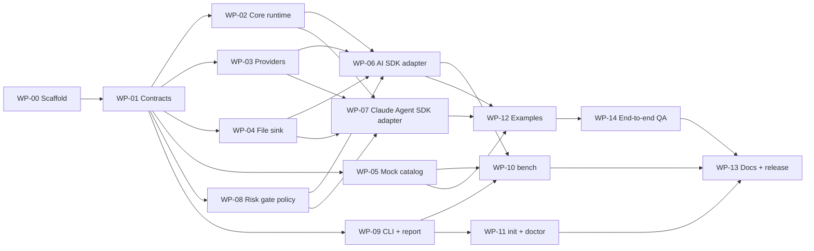

# krino v0.1 — plan index

> Owner: Sushil (lead, reviewer, merger). Workers: Claude Code, Codex, Cursor agents.
> Put this folder at `docs/plan/` in the repo. Copy `AGENTS.md` and `CLAUDE.md` to the repo root.

## 📁 What is in this folder

| File | Purpose |
|---|---|
| [`AGENTS.md`](../../AGENTS.md) | Rules every agent follows (copy to repo root) |
| [`CLAUDE.md`](../../CLAUDE.md) | One line that makes Claude Code read `AGENTS.md` (copy to repo root) |
| [`architecture.md`](./architecture.md) | Architecture, decisions, trade-offs, perks |
| [`shared/01-scope.md`](./shared/01-scope.md) | v0.1 scope and release definition of done |
| [`shared/02-repo-layout.md`](./shared/02-repo-layout.md) | Target folders and package exports |
| [`shared/03-contracts.md`](./shared/03-contracts.md) | **Binding** frozen types |
| [`shared/04-behavior-rules.md`](./shared/04-behavior-rules.md) | **Binding** fail-open / fail-closed rules |
| [`shared/05-review-checklist.md`](./shared/05-review-checklist.md) | PR review checklist |
| [`shared/06-open-items.md`](./shared/06-open-items.md) | APIs to verify |
| [`shared/07-timeline.md`](./shared/07-timeline.md) | Weekend timeline |
| `work-packages/wp-XX-*.md` | One file per agent task, with its own kickoff prompt |

## 🧭 How to use it

1. **Run phase 0 yourself** (or with one agent). It creates the repo skeleton and freezes the contracts. Nothing else starts before it merges.
2. **Assign each work package (WP) to one agent**, in its own git worktree and branch: `wp-XX-short-name`.
3. **Give the agent three things:** `AGENTS.md`, its work package file. Each file ends with a ready kickoff prompt.
4. **One WP = one pull request.** Review against the WP's acceptance criteria. Merge in dependency order (the dependency graph below).
5. **Contracts are frozen** after WP-01. An agent that needs a contract change stops, writes the request in its PR description, and waits.

### 🧰 Tool fit (suggested)

| Tool | Best for |
|---|---|
| Claude Code | WPs with many files and design judgment: WP-02, WP-06, WP-07, WP-10 |
| Codex | Well-specified, test-heavy WPs: WP-03, WP-04, WP-08, WP-11 |
| Cursor | UI-like or content-heavy WPs, quick iterations: WP-05, WP-09, WP-12, WP-13 |

All tools read `AGENTS.md`. Claude Code reads `CLAUDE.md`, which imports `AGENTS.md` ([`AGENTS.md`](../../AGENTS.md)).

## 🔗 Dependencies and waves

| Wave | Work packages (parallel inside a wave) | Agents at once |
|---|---|---|
| 0 | WP-00 → WP-01 (sequential) | 1 |
| 1 | WP-02, WP-03, WP-04, WP-05, WP-08, WP-09 | up to 6 |
| 2 | WP-06, WP-07, WP-11 | up to 3 |
| 3 | WP-10, WP-12 | 2 |
| 4 | WP-14 → WP-13 | 1 |

## ✅ Work package tracker

| Done | WP | Title |
|---|---|---|
| ☐ | [WP-00](./work-packages/wp-00-repo-scaffold.md) | Repo scaffold |
| ☐ | [WP-01](./work-packages/wp-01-contracts.md) | Contracts |
| ☐ | [WP-02](./work-packages/wp-02-core-runtime.md) | Core runtime |
| ☐ | [WP-03](./work-packages/wp-03-decision-providers.md) | Decision providers |
| ☐ | [WP-04](./work-packages/wp-04-file-trace-sink-redaction.md) | File trace sink + redaction |
| ☐ | [WP-05](./work-packages/wp-05-mock-tool-catalog-task-set.md) | Mock tool catalog + task set |
| ☐ | [WP-06](./work-packages/wp-06-vercel-ai-sdk-adapter.md) | Vercel AI SDK adapter |
| ☐ | [WP-07](./work-packages/wp-07-claude-agent-sdk-adapter.md) | Claude Agent SDK adapter |
| ☐ | [WP-08](./work-packages/wp-08-risk-gate-policy.md) | Risk gate policy |
| ☐ | [WP-09](./work-packages/wp-09-cli-foundation-krino-report.md) | CLI foundation + `krino report` |
| ☐ | [WP-10](./work-packages/wp-10-krino-bench.md) | `krino bench` |
| ☐ | [WP-11](./work-packages/wp-11-krino-init-krino-doctor.md) | `krino init` + `krino doctor` |
| ☐ | [WP-12](./work-packages/wp-12-examples.md) | Examples |
| ☐ | [WP-13](./work-packages/wp-13-docs-release.md) | Docs + release |
| ☐ | [WP-14](./work-packages/wp-14-end-to-end-qa.md) | End-to-end QA |
