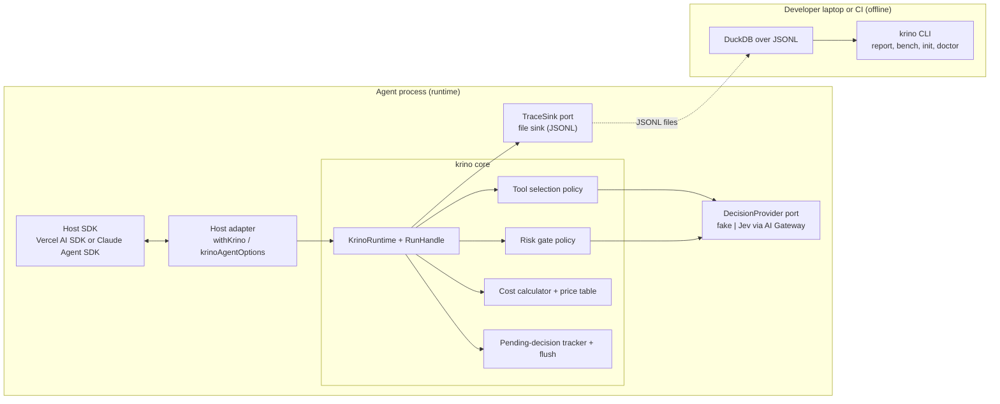
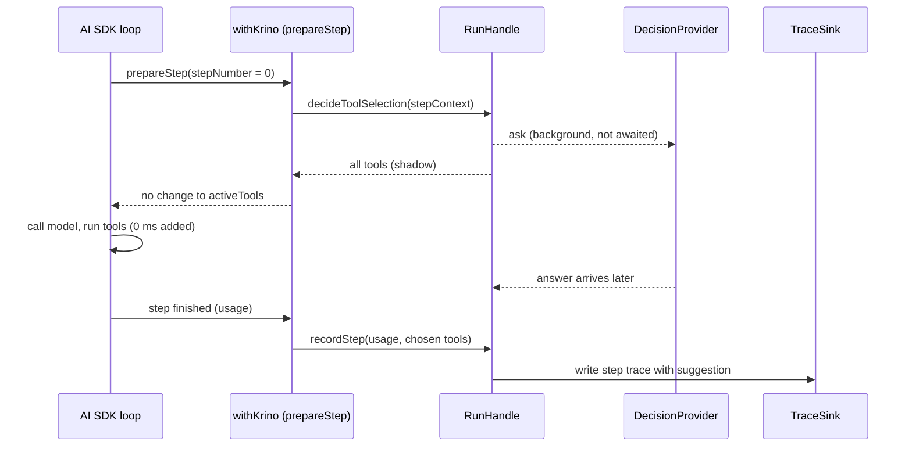
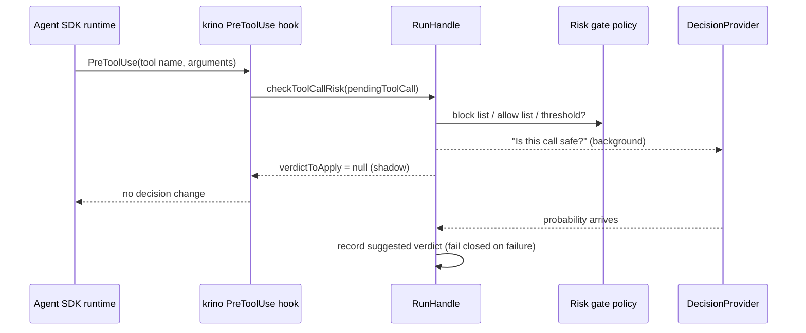

# krino v0.1 — software architecture

> Scope: `@krinolabs/krino` (runtime library) and `@krinolabs/cli` (offline tools), v0.1.
> Binding details live in [`shared/03-contracts.md`](./shared/03-contracts.md) and [`shared/04-behavior-rules.md`](./shared/04-behavior-rules.md). This document explains **why** the system has this shape.

---

## 1. 📌 Summary

- **Style:** an **in-process library** built as **ports and adapters** (hexagonal architecture).
- **Runtime path:** host adapter → `RunHandle` → decision policies → ports (decision provider, trace sink, prices).
- **Analysis path:** a separate CLI reads JSONL traces **offline** with DuckDB.
- **Default behavior:** **shadow mode**. krino watches and records; it changes nothing.
- **Safety model:** tool selection **fails open**; the risk gate **fails closed**. Both rules live in the core.

---

## 2. 🗺️ Big picture

---

## 3. 🧩 Components

| Component | Responsibility | Location | Depends on |
|---|---|---|---|
| Contracts | Types for every boundary; frozen after WP-01 | `src/contracts/` | nothing |
| Runtime (`createKrino`, `RunHandle`) | Orchestrates one run: modes, timeouts, failure rules, exploration, trace writes | `src/core/` | contracts, ports |
| Tool selection policy | Builds questions; picks tools to send; step 0 / run start only | `src/core/` | provider port |
| Risk gate policy | Block / allow lists, per-tool thresholds, fail closed | `src/risk-gate/` | contracts only (pure) |
| Cost calculator + price table | Cost from usage, including cache read and write | `src/core/`, `src/pricing/` | contracts |
| Pending-decision tracker | Tracks background calls; flush; writes `cutOff` | `src/core/` | sink port |
| Decision providers | Answer typed questions | `src/providers/` | contracts; Jev provider uses `ai` |
| Trace sink (file) | Append JSONL; daily files; rotation; redaction | `src/sinks/`, `src/redaction/` | contracts, Node `fs` |
| AI SDK adapter | `prepareStep` (step 0), wraps tool `execute`, reads usage | `src/adapters/ai-sdk/` | runtime, `ai` (peer) |
| Tool selection | Claude Agent SDK: `disallowedTools` at query start (run start only). `allowedTools` is never changed: it controls approval, not availability. |
| CLI | `report`, `bench`, `init`, `doctor` | `packages/cli/` | trace format, DuckDB |
| Bench catalog | 100 mock tools, 60 tasks, fake executors | `bench/` | host SDKs (dev only) |

### 🔒 Dependency rules

- `contracts/` imports nothing.
- `core/` and `risk-gate/` import only `contracts/`. No Node I/O, no host SDK, no `ai`.
- Adapters import `core/` and their own host SDK. They never import each other.
- The root entry point (`@krinolabs/krino`) never imports a host SDK or `ai`. An E2E test enforces this (WP-14).
- The CLI reads the **trace format**, not the runtime. It can analyze traces from any future host.

---

## 4. 🔄 Runtime flows

### 4.1 Shadow tool selection (AI SDK, step 0)

### 4.2 Enforce tool selection (step 0 only)

- The adapter **awaits** the decision, up to `decisionTimeoutInMilliseconds` (default 800 ms).
- If the answer is confident: step 0 gets `activeTools = selected tools`. **Steps 1+ keep the same list.**
- If the answer fails, times out, or is not confident: all tools (fail open).
- About 5% of runs (`explorationRate`) skip enforcement to keep counterfactual data.

### 4.3 Shadow risk gate (Claude Agent SDK)

### 4.4 Run end and flush

1. The adapter detects the end (AI SDK: run finished, error, or abort; Agent SDK: `result` message).
2. It calls `finishRun(summary)`.
3. The runtime waits for pending decisions up to the flush timeout (default 2 s).
4. Unfinished decisions are written with status `cutOff`.
5. The sink flushes its buffer to disk.

---

## 5. 📐 Decisions made

| # | Decision | Why | Rejected alternatives |
|---|---|---|---|
| D1 | In-process library, not a proxy | Needs step context and the power to pause a tool call; no network hop | HTTP proxy or gateway (sees requests, not decisions) |
| D2 | TypeScript only (Node 22+) | Must run in the host's language; both hosts are TypeScript | Go or Rust (would force a proxy); Python first (smaller TS audience for this owner) |
| D3 | Ports and adapters | Hosts and Jev are new and change often; keeps change at the edges | One adapter-specific codebase per host |
| D4 | Shadow mode is the default | Zero-risk adoption; free counterfactual data | Enforce by default |
| D5 | Shadow calls run in the background | 0 ms added latency | Awaiting shadow calls |
| D6 | Tool selection only at step 0 / run start | Changing the tool list later breaks the prompt cache for the whole conversation | Per-step pruning (kept only in bench to prove the trap) |
| D7 | Failure rules live in the core | Same safety for every host; adapters cannot weaken it | Per-adapter rules |
| D8 | Risk gate cannot fail open | A wrong "safe" costs trust; block rules in code beat the model | Configurable fail mode |
| D9 | JSONL traces; analysis offline in the CLI | No database in the user's app; rerunnable reports | SQLite in-process; hosted backend |
| D10 | Redact content by default | Traces would hold prompts and tool data | Raw text by default |
| D11 | Each adapter declares `HostCapabilities` | Hosts expose different control points | Lowest common denominator API |
| D12 | Explicit `flush()` and `cutOff` status | Short CLI processes exit before background calls finish | Ignore unfinished calls (biases data) |
| D13 | Contracts frozen after WP-01; stub runtime | Lets 3–6 agents work in parallel safely | Evolving types during the build |
| D14 | Fake provider is the default; Jev at its own import path | Tests need no network; root package never imports `ai` | Jev as a hard dependency |
| D15 | `@krinolabs/krino` + `@krinolabs/cli` only | CLI's DuckDB native binary must not enter the app | One package; one package per adapter |
| D16 | Optional peer dependencies for host SDKs | Users install only their host | Bundled host SDKs |
| D17 | Daily JSONL files, rotate at 50 MB | Simple, appendable, easy to delete | One file per run; one big file |

---

## 6. ⚖️ Known trade-offs

| Trade-off | What it costs | Mitigation | Revisit when |
|---|---|---|---|
| In-process only | No support for non-TypeScript agents (Python, Go) | Keep the trace format language-neutral; a Python port can reuse the CLI | Real demand from Python users |
| Claude Agent SDK gives hooks, not the loop | Tool selection only at run start; agreement metric is per run, coarser than the AI SDK's per step | Label metrics per host in reports | The SDK adds per-turn tool control |
| Step-0-only pruning | Smaller saving than per-step pruning; tasks that need new tools later get no benefit | Benchmark shows the net effect with cache costs | Anthropic deferred-tool loading is verified and wired in |
| Shadow decisions cost money | You pay for decisions you do not use (≈ $0.0003 per decision on an 8K-token state, own estimate) | Shadow is cheap and time-limited; report shows the spend | Teams run shadow long-term |
| Background calls in short processes | Some decisions end as `cutOff` | `flush()` with timeout; report shows the cut-off count | Cut-off rate > 5% |
| Local JSONL files | Lost on serverless; no cross-machine view; disk growth | Daily files, rotation, `KRINO_TRACE_DIRECTORY`; console/OTel sinks later | Serverless support (post v0.1) |
| DuckDB native binary in the CLI | Bigger install; platform issues possible | Separate CLI package; `doctor` checks; JSONL stays readable by hand | Install problems reported |
| Redaction by default | Less context when debugging; replay needs raw text | Opt-in `redactContent: false` | Replay feature |
| Token budget estimated as characters ÷ 4 | Context trimming is approximate | 10% margin; provider errors fall back safely | Jev exposes a tokenizer or count |
| One real decision provider (Jev) | Vendor risk: price, API, or availability can change | Provider port; fake provider; model version in every trace | Second provider appears |
| Jev latency is vendor-reported (70–500 ms) | Enforce mode may add more delay than expected | Timeout (800 ms) and fail open; bench measures real latency | Bench results |
| Contract freeze | Changes are slower; needs an ADR | Freeze only after WP-01; change requests in PRs | v0.2 planning |
| Fake provider as default | Risk of a silent no-op setup | Startup warning; `krino doctor` flags it | Never: keep the warning |
| Optional peer dependencies | Users can install an untested host version | Tested range in docs; `doctor` checks versions | Each host major release |
| Exploration rate (5%) | Some enforced runs cost more | Configurable; can be 0 | Calibration data is good enough |

---

## 7. ✨ Perks of this architecture

- **Vendor-neutral.** The core never knows which decision model runs. Swapping Jev for another model is one new provider file.
- **Host-neutral.** A new host (Pi, a Python port) is one adapter and a capability declaration. The core and CLI stay the same.
- **Zero-risk adoption.** Shadow mode adds 0 ms and changes nothing, so teams can try it in production on day one.
- **Cache-safe by construction.** Tool lists change only before the first model call. The cache trap cannot happen in normal use.
- **Safety in one place.** Fail-open and fail-closed rules sit in the core, so no adapter can weaken them.
- **Fast, free tests.** Pure policies, a fake provider, and recorded fixtures mean no network and no API cost in CI.
- **Small runtime footprint.** The app gets the core plus one adapter. Heavy analysis (DuckDB) stays in the CLI.
- **Reproducible numbers.** Every trace line has model, SDK, and price versions. Reports and benchmarks can be rerun.
- **Honest metrics.** `cutOff`, `skippedUnsupported`, and `skippedExploration` statuses keep missing data visible instead of hidden.
- **Parallel development.** Frozen contracts and a stub runtime let up to 6 agents build at the same time.
- **A strong story.** Each design choice maps to a problem you can explain in a talk or interview: the cache trap, the feedback loop, fail open vs. fail closed.

---

## 8. 🔌 Extension points

| To add… | Do this | Touches the core? |
|---|---|---|
| A decision provider | Implement `DecisionProvider` in `src/providers/<name>/`; add fixtures | No |
| A trace sink (console, OTel) | Implement `TraceSink` in `src/sinks/<name>/` | No |
| A host | Add `src/adapters/<host>/`; declare `HostCapabilities`; call `RunHandle` | No |
| A decision kind (model routing, stop check) | Extend `DecisionKind` (ADR), add a policy, add rows to the behavior rules | Yes (planned change) |
| A CLI command | Add `packages/cli/src/commands/<name>`; read the trace format | No |

---

## 9. 📏 Quality targets (v0.1)

| Attribute | Target | How it is checked |
|---|---|---|
| Added latency, shadow mode | 0 ms on the agent's path | WP-02 test with a 5 s provider |
| Added latency, enforce mode | ≤ decision timeout (800 ms default), step 0 only | WP-06 tests; bench measures real values |
| Reliability | krino never throws into the host from a background path | Failure-path tests (WP-02, WP-04) |
| Data loss on exit | Unfinished decisions recorded as `cutOff` | WP-04 child-process test |
| Privacy | No raw task text in traces by default | WP-04 search test |
| Report speed | 100 MB of traces in < 5 s | WP-09 measurement |
| Cost accuracy | Within a few percent of the provider dashboard | Lab step 6; bench |
| Package hygiene | Root import pulls in no host SDK or `ai` | WP-14 test |

---

## 10. 🚫 Non-goals (v0.1)

- Owning or replacing the agent loop.
- Hosting traces, dashboards, or user accounts.
- Supporting languages other than TypeScript.
- Enforcing the risk gate (shadow only in v0.1).
- Routing between big models (planned, not in v0.1).

---

## 11. 🧭 When to revisit this architecture

- A second real decision provider appears → test the provider port with two implementations.
- Users ask for serverless → add console and OpenTelemetry sinks, and `waitUntil(flush())` docs.
- The Claude Agent SDK adds per-turn tool control → upgrade its capabilities and tool-selection timing.
- Bench shows step-0 pruning saves too little → evaluate Anthropic's deferred-tool loading as a cache-safe alternative.
- Cut-off rate stays above 5% → reconsider default flush timeouts or synchronous shadow for very short runs.
