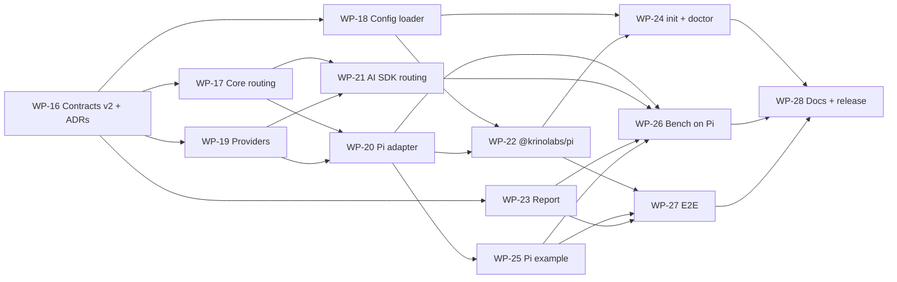

# krino v0.2 plan — Pi host and model routing

> Owner: Sushil (lead, reviewer, merger). Workers: Claude Code, Codex, Cursor agents.
> Status: **proposed** (2026-10-10). Work packages WP-16 to WP-28.
> Pi version read for this plan: `@earendil-works/pi-coding-agent` **1.1.0** (npm, published
> 2026-10-07; docs and `src/core/extensions/types.ts` on `main`, read 2026-10-10).

This plan adds [Pi](https://pi.dev/) as krino's third host and adds a third decision kind,
**model routing**, on Pi and on the Vercel AI SDK. The rules in [`AGENTS.md`](../../../AGENTS.md)
still apply. Every card ends with a kickoff prompt, like the v0.1 cards.

---

## 1. 📌 Requirements (agreed 2026-10-10)

| # | Question | Decision |
|---|---|---|
| R1 | Who uses krino on Pi? | **Both:** people who run the `pi` CLI (a Pi package) and apps that embed Pi with `createAgentSession` (SDK). One extension factory serves both. |
| R2 | Decision provider on Pi | **Pi's own classifier by default** (`ctx.modelRegistry.classify()` with `typesafe/jev-latest`, using the user's Pi credentials). The existing Jev-through-AI-Gateway provider stays selectable. |
| R3 | Risk gate on Pi | **Shadow only**, as in v0.1. No blocking. |
| R4 | Run model on Pi | **One user prompt = one krino run**; each Pi turn is one step. Tools are picked at the **session's first prompt** and kept for the rest of the session (session tool lock). |
| R5 | Packaging | **New package `@krinolabs/pi`**: a thin Pi package for `pi install`. The adapter lives at `@krinolabs/krino/pi` for SDK users. |
| R6 | Config for Pi package users | **`krino.config.json`**, read by a new shared loader (`loadKrinoConfig`). This builds the v0.2 backlog item of the same name. |
| R7 | Extras | `krino init` + `krino doctor` for Pi, an example project, site + README docs, and the benchmark on Pi. |
| R8 | Model routing | **Build it.** New decision kind `modelRouting`. |
| R9 | Model routing hosts | **Pi** (virtual model `krino/auto`) **and the Vercel AI SDK** (`prepareStep` `model`). The Claude Agent SDK declares it unsupported. |
| R10 | When to route | **On the first request of each run, then sticky.** Tool follow-ups, retries, steering, and follow-ups in the same run keep that model. |
| R11 | Routing candidates | **A list in config:** 2–4 models, each with a one-line `useWhen`. One is the fallback. |

---

## 2. 🔌 What Pi gives krino

Pi is a minimal coding-agent harness. Extensions are TypeScript modules loaded into the Pi
process. They get an `ExtensionAPI` (`pi`) with lifecycle events, tool control, and model
registration. Pi has no permission system of its own ("no permission popups"), and its docs
suggest building one with the `tool_call` event.

| Pi API (1.1.0) | What it does | krino use |
|---|---|---|
| `session_start` / `session_shutdown` | Session lifecycle; shutdown also runs on reload, switch, fork, and exit | Build and tear down session state; `flushAll` on shutdown |
| `before_agent_start` | After a user prompt, before the agent loop; has `prompt` and mutable `systemPromptOptions` (including `selectedTools`) | Start a krino run; tool selection on the session's first run; shadow model routing |
| `pi.getAllTools()` / `pi.getActiveTools()` / `pi.setActiveTools()` | Tool info (with `exposure` and `annotations`); the active set is what the model sees | Tool descriptions for the question; enforce narrows the active set once |
| `tool_call` | Before each tool runs, including nested calls (`parentToolCallId`); can return `{ block, reason }` | Risk gate (shadow): never blocks |
| `turn_start` / `turn_end` (`turnIndex`) | One assistant response plus its tool calls | Step boundary → `recordStep` |
| `message_end` (assistant) | Final message with `provider`, `model`, tool calls, and `usage` (`input`, `output`, `cacheRead`, `cacheWrite`, `cost`) | Per-step usage and cost |
| `agent_end` / `agent_settled` | `agent_end` can be followed by retries or queued work; `agent_settled` is final | Run end → `finishRun` on `agent_settled` |
| `pi.registerVirtualModel()` → `route(request, ctx)` | A selectable model that picks a physical model per request; `request.reason` is `user`, `continuation`, `retry`, or `direct` | Model routing (`krino/auto`) |
| `ctx.modelRegistry.classify()` + `findOfType("classifier", "typesafe", "jev-latest")` | Structured classifier call with `choice`, `score`, and `bool` questions; never rejects; returns `usage` with cost | Pi-native decision provider |
| `pi.appendEntry()` | Session data that never enters model context and follows the session tree | Persist the session tool lock |
| `pi.registerCommand()` | `/` commands | `/krino` status and `/krino unlock` |
| Pi packages (`pi install npm:…`, `pi-package` keyword, `pi.extensions` manifest) | Distribution | `@krinolabs/pi` |

Facts that shape the design:

- **A `tool_call` handler that throws blocks the tool** ("as a fail-safe"). krino's handler must
  never throw, or krino would block the user's tools.
- **A `route()` that throws ends the request with an error.** krino's router must never throw; it
  returns the fallback model instead.
- **Tool changes are appended to the transcript** before the next request. "Providers that cannot
  represent the transition receive a complete transcript checkpoint, which can invalidate the
  cached prefix." So a tool change after the first request can still cost a cache miss. The
  session lock avoids it; WP-26 measures it.
- **Switching models between turns loses the prompt cache** (Pi's virtual-model docs). Routing
  stays sticky inside a run.
- **Pi already ships a Jev classifier.** Pi's own `jev-router.ts` example routes with it. krino's
  Pi provider uses the same API.
- Pi needs Node **22.19** or later (its `engines` field). krino's Pi paths inherit that floor.

---

## 3. 🧭 Design decisions

| # | Decision | Why | Rejected alternatives |
|---|---|---|---|
| D21 | The Pi integration is an in-process **extension factory**, `createKrinoPiExtension()`, exported from `@krinolabs/krino/pi` | Same hook points for CLI and SDK users; matches D1 (in-process library) | Out-of-process JSON/RPC observer (sees events, cannot enforce) |
| D22 | **Run = one user prompt** (`before_agent_start` → `agent_settled`); **step = one Pi turn** | Matches Pi's own run boundary; traces reach disk after every prompt in long interactive sessions | Run = whole session (summary only at exit; lost on a crash) |
| D23 | **Session tool lock:** tool selection runs once per session, before the first model request; enforce calls `setActiveTools` once and persists the lock with `pi.appendEntry` | Keeps the tool list stable for the whole conversation, so the cache holds (extends ADR-006) | Re-pick tools on every prompt (cache miss on most providers) |
| D24 | Pi's capabilities: `{ supportedDecisions: ['toolSelection', 'riskGate', 'modelRouting'], toolSelectionTiming: 'runStartOnly', reportsPerStepUsage: true }`; tool-selection agreement is **per run** ("every used tool is inside the session's locked suggestion") | Runs 2+ have no step-0 decision of their own; a per-run metric still measures whether the lock fits each prompt | Per-step agreement (no data after run 1) |
| D25 | **Model routing** is a new `DecisionKind`, `modelRouting`. It **fails open to the fallback model**; decides on the **first request of a run** only; later requests in the run reuse that model | Same shape as tool selection: cheap when confident, today's cost when not; cache-safe | Per-request routing (cache misses); fail to the cheapest model (quality risk) |
| D26 | **Shadow routing needs no model switch.** On Pi, shadow observes in `before_agent_start` whatever model is selected. **Enforce needs the `krino/auto` virtual model** to be selected. On the AI SDK, enforce returns `model` from `prepareStep` on every step | Users get shadow data on day one without changing their setup (D4) | Shadow only through `krino/auto` |
| D27 | Routing measures **cost** directly and **quality** by proxy. The run summary gets `routingCounterfactualCostInUsd` and `runOutcome`. The report compares routed runs with fallback and exploration runs (steps, errors, aborts) | Shadow cannot show whether a cheaper model would have succeeded; proxies plus exploration keep the data honest | No quality signal (hides the main risk) |
| D28 | **Third package `@krinolabs/pi`** (amends ADR-015). It depends on `@krinolabs/krino`, declares Pi's packages as `"*"` peers, and its default export builds the runtime from `krino.config.json` | `pi install` needs a package with a `pi` manifest and no code from the user | Make `@krinolabs/krino` itself a Pi package (Pi does not install its optional peers; core carries host metadata) |
| D29 | **`loadKrinoConfig()`** in `@krinolabs/krino` reads and validates `krino.config.json`. The decision provider is named in JSON; the caller builds it | Pi package users cannot write code; the CLI and the runtime share one schema (backlog item) | Env vars and flags only |
| D30 | **Host-bound decision provider:** `createPiClassifierProvider()` wraps a structural `classify` client taken from `ctx.modelRegistry`. It is exported only from `@krinolabs/krino/pi` | Uses the user's Pi credentials; no `ai` dependency; priced from the classifier's own `usage` | Only Jev through AI Gateway (second key, second bill) |
| D31 | **Trace schema version 2:** additive fields only; readers accept 1 and 2 | New run-summary fields for routing; old traces stay readable | Silent shape change under version 1 |
| D32 | **Price precedence:** user `priceOverrides` → host prices (Pi catalog, passed per run) → `DEFAULT_MODEL_PRICES` | Pi routes across 15+ providers that krino's table does not list | krino's table only (no prices for most Pi models) |

Each decision gets an ADR in WP-16: ADR-021 (Pi host, D21–D24), ADR-022 (third package, D28),
ADR-023 (model routing, D25–D27), ADR-024 (config loader, D29), ADR-025 (host-bound provider,
D30), ADR-026 (trace schema v2 and price precedence, D31–D32).

---

## 4. 🧾 Contract changes (WP-16, lead)

Contracts are frozen after WP-01, so every change below needs the ADRs above. WP-16 makes all of
them at once so that later WPs code against a fixed v2 surface. Proposed shapes (WP-16 may refine
the names, not the meaning):

```ts
// decisions.ts
export type DecisionKind = "toolSelection" | "riskGate" | "modelRouting";
// DecisionQuestion gains:
//   /** One line per option, same order as `options`: what the option means. Choice questions only. */
//   optionCriteria?: Array<string>;
// (Routing sends each candidate's `useWhen`; Pi's classifier and Jev both take per-option criteria.)

// host.ts
export type HostName = "ai-sdk" | "claude-agent-sdk" | "pi";

export type ModelRouteContext = {
  /** Step 0 of the run. */
  stepContext: StepContext;
  /** The model the host would use without krino. Shadow mode keeps it. */
  hostModelIdentifier: string;
  /** Candidates the host can use right now (for example, Pi models with credentials). */
  availableCandidateIdentifiers: Array<string>;
  /** `false` when the host cannot apply a route this run (Pi: `krino/auto` is not selected). Enforce then records `skippedUnsupported`; shadow still asks. */
  canApplyRoute: boolean;
};

// config.ts
export type ModelCandidate = {
  /** The host's identifier: a Pi `provider/id`, or an AI SDK model id such as "anthropic/claude-haiku-4.5". */
  modelIdentifier: string;
  /** One line sent to the decision model: when this model is enough. */
  useWhen: string;
};

export type ModelRoutingPolicy = {
  candidateModels: Array<ModelCandidate>; // 2 to 4 entries
  /** One of the candidates. Used on failure, timeout, low confidence, and exploration. */
  fallbackModelIdentifier: string;
};
// KrinoConfig gains: modelRoutingPolicy?: ModelRoutingPolicy

// runtime.ts
export type ModelRouteOutcome = {
  /** Shadow mode: always `hostModelIdentifier`. */
  modelIdentifierToUse: string;
  decisionRecord: DecisionRecord;
};
// RunHandle gains: decideModelRoute(modelRouteContext): Promise<ModelRouteOutcome>
// RunStartOptions gains: hostModelPrices?: Array<ModelPrice>

// trace.ts
export const TRACE_SCHEMA_VERSION = 2 as const;
export type TraceSchemaVersion = 1 | typeof TRACE_SCHEMA_VERSION;
export const SUPPORTED_TRACE_SCHEMA_VERSIONS: ReadonlyArray<TraceSchemaVersion>; // [1, 2]: what readers accept
export type RunOutcome = "completed" | "aborted" | "error";
// DecisionRecord choice encoding gains: `modelRouting`: the model identifier.
// RunSummaryTrace gains:
//   routingCounterfactualCostInUsd: number | null  // run tokens at the suggested model (shadow) or the fallback (enforce)
//   runOutcome: RunOutcome | null
// RunSummaryInput omits `routingCounterfactualCostInUsd` (the runtime fills it, like `recordedAt`)
// and makes `runOutcome` optional (default `null`), so v0.1 adapters and user code keep compiling.
```

Default mode: `modelRouting` defaults to `shadow`, like every decision kind; without a
`modelRoutingPolicy` it does nothing. `"enforce"` without a policy is a
`KrinoConfigurationError`. The risk gate still rejects `"enforce"`. (Refined in the WP-16 plan
review, 2026-10-10.)

---

## 5. 🧷 New behavior rules (draft for `04-behavior-rules.md`, WP-16)

| Situation | Model routing (fail open to the fallback) | `decisionStatus` |
|---|---|---|
| Shadow mode | Host keeps its model; record the suggestion | `answered` |
| Provider times out | Fallback model | `timedOut` |
| Provider error | Fallback model | `failed` |
| Probability < minimum | Fallback model | `answered` |
| Answer names a model that is not an available candidate | Fallback model | `failed` |
| Context over budget | Trim; retry once; else fallback model | `failed` |
| Host cannot apply the decision (Pi enforce without `krino/auto` selected; fallback model not available) | Skip | `skippedUnsupported` |
| Exploration sample (enforce) | Fallback model | `skippedExploration` |
| Process exits before answer | Nothing applied | `cutOff` |

- **Model routing decides once per run, on its first request.** Tool follow-ups, retries,
  steering, and follow-up messages in the same run keep that model. Never switch models inside a
  run: it breaks the prompt cache.
- **Requests outside the agent loop** (Pi `reason: "direct"`, such as compaction summaries) use
  the fallback model and are not decisions.
- **Model routing uses `minimumConfidence`**, like tool selection.
- **Pi: krino's handlers never throw.** A throwing `tool_call` handler blocks the tool in Pi, and a
  throwing `route()` fails the request. Catch everything; fail open (fallback model, all tools)
  and record the failure.
- **Pi: the tool list changes at most once per session**, before the first model request of the
  first run. Enforce never adds a tool that was not active. `/krino unlock` restores the full
  set (user action, recorded in the session).
- **Pi: the risk gate is shadow-only.** The `tool_call` handler never returns `block`.

---

## 6. 📦 Work packages

| WP | Title | Owns (summary) | Owner role |
|---|---|---|---|
| [WP-16](./wp-16-contracts-v2-adrs.md) | Contracts v2 + ADRs | `src/contracts/**`, `docs/adr/`, shared plan docs | lead |
| [WP-17](./wp-17-core-model-routing.md) | Core: model routing, trace v2, host prices | `src/core/**`, `src/pricing/**` | Claude Code |
| [WP-18](./wp-18-config-loader.md) | `loadKrinoConfig` (shared config file) | `src/config/**` | Codex |
| [WP-19](./wp-19-providers-routing-pi-classifier.md) | Providers: routing questions + Pi classifier | `src/providers/**` | Codex |
| [WP-20](./wp-20-pi-adapter.md) | Pi adapter (`@krinolabs/krino/pi`) | `src/adapters/pi/**` | Claude Code |
| [WP-21](./wp-21-ai-sdk-model-routing.md) | AI SDK model routing | `src/adapters/ai-sdk/**` | Claude Code |
| [WP-22](./wp-22-krinolabs-pi-package.md) | `@krinolabs/pi` Pi package | `packages/pi/**` | Claude Code |
| [WP-23](./wp-23-report-pi-model-routing.md) | `krino report`: Pi, routing, trace v2 | `packages/cli/src/report/**`, `trace-reader/**` | Codex |
| [WP-24](./wp-24-init-doctor-pi.md) | `krino init` + `krino doctor` for Pi | `packages/cli/src/commands/{init,doctor}*` | Codex |
| [WP-25](./wp-25-pi-example.md) | Example: `examples/pi-cli` | `examples/pi-cli/**` | Cursor |
| [WP-26](./wp-26-bench-on-pi.md) | Benchmark on Pi (tools + routing) | `bench/src/hosts/pi*`, `bench-runner/src/**` | Claude Code |
| [WP-27](./wp-27-e2e-pi.md) | End-to-end QA for Pi and three packages | `e2e/**` | Claude Code |
| [WP-28](./wp-28-docs-site-release-v0-2.md) | Docs, site, and v0.2.0 release | READMEs, `site/content/docs/**`, plan docs | Cursor + lead |

### 🔗 Dependencies and waves



| Wave | Work packages (parallel inside a wave) | Agents at once |
|---|---|---|
| 0 | WP-16 | 1 |
| 1 | WP-17, WP-18, WP-19, WP-23 | up to 4 |
| 2 | WP-20, WP-21 (both may start on the v2 stub runtime in wave 1) | 2 |
| 3 | WP-22, WP-24, WP-25 | 3 |
| 4 | WP-26, WP-27 | 2 |
| 5 | WP-28 | 1 |

### ✅ Tracker

| Done | WP | Title |
|---|---|---|
| ☐ | [WP-16](./wp-16-contracts-v2-adrs.md) | Contracts v2 + ADRs |
| ☐ | [WP-17](./wp-17-core-model-routing.md) | Core: model routing, trace v2, host prices |
| ☐ | [WP-18](./wp-18-config-loader.md) | `loadKrinoConfig` |
| ☐ | [WP-19](./wp-19-providers-routing-pi-classifier.md) | Providers: routing questions + Pi classifier |
| ☐ | [WP-20](./wp-20-pi-adapter.md) | Pi adapter |
| ☐ | [WP-21](./wp-21-ai-sdk-model-routing.md) | AI SDK model routing |
| ☐ | [WP-22](./wp-22-krinolabs-pi-package.md) | `@krinolabs/pi` |
| ☐ | [WP-23](./wp-23-report-pi-model-routing.md) | `krino report` for Pi and routing |
| ☐ | [WP-24](./wp-24-init-doctor-pi.md) | `krino init` + `krino doctor` for Pi |
| ☐ | [WP-25](./wp-25-pi-example.md) | `examples/pi-cli` |
| ☐ | [WP-26](./wp-26-bench-on-pi.md) | Benchmark on Pi |
| ☐ | [WP-27](./wp-27-e2e-pi.md) | End-to-end QA |
| ☐ | [WP-28](./wp-28-docs-site-release-v0-2.md) | Docs, site, v0.2.0 release |

---

## 7. 🔍 Verify before building

These came from the docs, not from running code. The WP that owns each one checks it against
the installed version and writes the result in its PR.

| # | Question | Owner |
|---|---|---|
| V1 | Does `setActiveTools()` inside `before_agent_start` apply to the **first** request of that run, or only to the next one? Is `systemPromptOptions.selectedTools` the right lever instead (or both)? | WP-20 |
| V2 | Does `before_agent_start` fire for steering and follow-up messages, or once per `agent_settled` cycle? Is `turnIndex` 0-based and per run? Do automatic retries emit their own `turn_end` and assistant `message_end`? | WP-20 |
| V3 | Exact option names to add an inline extension in the SDK (`DefaultResourceLoader({ extensionFactories })`, `resourceLoader.reload()`, and whether `session.bindExtensions()` is needed for `session_start`) | WP-20 |
| V4 | How to check that a model has credentials from an extension (for `availableCandidateIdentifiers`) | WP-20 |
| V5 | Classifier id and credentials: is `typesafe/jev-latest` stable? Does it read `TYPESAFE_API_KEY`, Pi's auth store, or both? Typical latency against the 800 ms timeout | WP-19 |
| V6 | Does a tool-list change after the first request break the prompt cache through Pi on Anthropic and OpenAI models (Pi's "transcript checkpoint")? | WP-26 (live) |
| V7 | In `ai` 7.0.126, does `prepareStep`'s `model` last one step only, like `activeTools` (ADR-020)? | WP-21 |
| V8 | How to read the installed Pi version at runtime (an exported `VERSION`, or `package.json`) | WP-20 |
| V9 | Does `pi install npm:@krinolabs/pi` warn about `@krinolabs/krino`'s optional peers (`ai`, `@anthropic-ai/claude-agent-sdk`)? | WP-22 |
| V10 | Does Pi's `usage.cost.total` match the provider dashboard within a few percent (cache writes included)? | WP-28 (verification day) |
| V11 | Does Pi await async `session_shutdown` handlers before the process exits (print and JSON modes too)? If not, how much of `flushAll` survives? | WP-20 |

---

## 8. ⚖️ Known trade-offs

| Trade-off | What it costs | Mitigation |
|---|---|---|
| Session tool lock | A later prompt may need a tool krino left out (enforce) | `/krino unlock`; per-run agreement in the report shows how often the lock was too narrow |
| Shadow routing cannot measure quality | Saving looks good, but the cheap model may fail on real work | Quality proxies (steps, errors, aborts), exploration runs on the fallback, and a report note; enforce stays opt-in |
| Counterfactual cost is an estimate | Another model uses other token counts and may take more turns | Labeled "estimated" in the report; bench measures real numbers |
| Pi moves fast (1.x, frequent releases) | Event or API names may change | Peer range `>=1.1.0 <2`; `krino doctor` checks the version; verified version in every PR |
| Third package | More release and maintenance work | Thin package (one file of glue); same changesets flow |
| `ai` as a dependency of `@krinolabs/pi` (for the optional Gateway provider) | Bigger install for users who never use AI Gateway | Lazy `import()`; revisit if users complain (open question in ADR-022) |
| Pi has no permission system | Risk-gate suggestions are recorded, but nothing acts on them in v0.2 | Risk-gate enforce on Pi is a v0.3 candidate (backlog row) |
| Pi's classifier is billed by TypeSafe through Pi | One more vendor account | AI Gateway Jev and the fake provider stay available |

---

## 9. 🚫 Out of scope

- Risk gate in enforce mode (any host). Add a v0.3 backlog row for Pi (`tool_call` → `block`;
  `askHuman` → `ctx.ui.confirm` when `ctx.hasUI`).
- Model routing on the Claude Agent SDK.
- An out-of-process Pi observer for JSON or RPC mode (the extension works in every Pi mode).
- Selecting `codemode`, `deferred`, or `hidden` tools; krino selects only active `direct` and
  `model-only` tools.
- Counting nested tool usage (`ToolResultMessage.usage`) and compaction or cache-warm usage in
  step traces. They stay in Pi's own totals; a backlog row tracks it.
- Python, hosted dashboards, console and OpenTelemetry sinks.

---

## 10. 🗒️ Lead to-dos outside the cards

- Add this plan and WP-16 to WP-28 to [`docs/plan/README.md`](../README.md) (tracker and graph).
- Move "Pi package" from "Out of scope for v0.1" to a v0.2 scope section in
  [`shared/01-scope.md`](../shared/01-scope.md) (WP-16 owns this edit).
- Mark the `loadKrinoConfig()` row in [`v0.2-backlog.md`](../v0.2-backlog.md) as planned in
  WP-18, and add the v0.3 rows from section 9.
